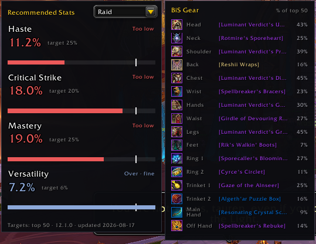
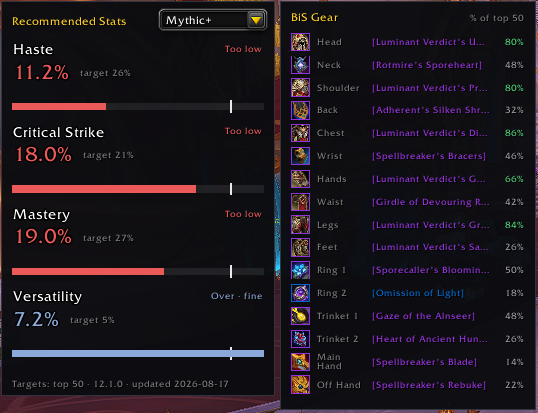
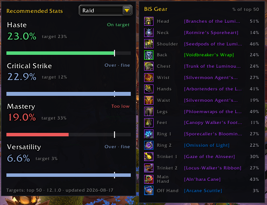
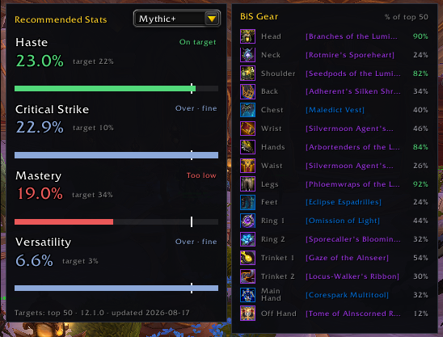

# RecommendedStats

A World of Warcraft addon that shows your secondary stats (Haste, Critical Strike, Mastery, Versatility) against targets pulled from top players for your class and spec, plus a best-in-slot gear list, right on the character screen.

## Features

- **Stat panel** docked next to the character screen, showing current vs. target for each secondary stat, with a progress bar and a target tick so you can see how far off you are, not just whether you're over or under.
- **Raid / Mythic+ toggle** so targets match the content you're actually doing.
- **BiS gear panel** listing the best item per slot for your class, spec, and content, with a tooltip on hover and a "% of top players using this" figure.
- **Minimap button**: left-click to show or hide both panels, right-click to open options.
- **Movable panels**: attach to the character screen by default, or detach and drag them anywhere. Positions are remembered per character.
- **Slash commands** for quick control without touching the mouse.

## Screenshots

| Raid | Mythic+ |
|---|---|
|  |  |
|  |  |

## Installation

1. Download the latest release (or clone this repo) into your WoW `Interface/AddOns` folder so you end up with `Interface/AddOns/RecommendedStats/RecommendedStats.toc`.
2. Restart WoW or reload your UI (`/reload`).
3. Enable RecommendedStats in the AddOns list if it isn't already.

## Usage

Open your character screen (`C`) and the stat panel appears automatically, with the BiS gear panel docked beside it.

**Minimap button**
- Left-click: show/hide both panels
- Right-click: open options

**Slash commands**

| Command | Effect |
|---|---|
| `/rs` | Print the current content setting |
| `/rs raid` | Show targets for Raid |
| `/rs mythicplus` (or `/rs m+`) | Show targets for Mythic+ |
| `/rs resetpos` | Reset panel positions back to their default dock point |
| `/rs options` | Open the options panel |

## Options

Available via Esc > Options > AddOns > RecommendedStats, or `/rs options`, or right-clicking the minimap button.

- **Panel position**: attach to the character screen, or leave unattached so it can be moved and shown independently.
- **Show BiS gear section**: toggle the BiS panel on or off.

## How targets are calculated

Stat targets and BiS gear are built from a sample of top players per class, spec, and content type (raid or Mythic+), sourced from raider.io and the Battle.net API. The current data set is built from a sample of 50 players and is refreshed as new content and patches land, the exact sample size and last-updated date are shown in the footer of the stat panel.

Stats are compared as:
- **Too low**: noticeably under target
- **On target**: within half a percentage point of target
- **Over, fine**: above target, which isn't a problem, it just means the point could be better spent elsewhere

## A note on combat and instances

Blizzard's Secret Values system restricts reading exact stat values while you're in an instance or in combat. When that happens, RecommendedStats still shows your current value and the progress bar, it just can't render a "too low / on target / over" verdict until the restriction lifts.

## Supported classes and specs

All current class/spec combinations are supported. If you find a spec with no data yet for your content type, the panel will say so rather than showing stale or wrong numbers.

## Feedback and issues

Found a bug, a spec with missing data, or a suggestion? Open an issue on this repo.

## License

MIT
