# RecommendedStats

A World of Warcraft addon that shows your secondary stats (Haste, Critical Strike, Mastery, Versatility) against targets pulled from top players for your class and spec, plus a best-in-slot gear list, the talent builds top players run for every boss and dungeon, and a rotation guide read from what those players actually press, right on the character screen.

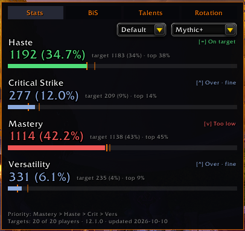

## Features

- **Stat panel** docked next to the character screen, showing current vs. target for each secondary stat, with a progress bar and a target tick so you can see how far off you are, not just whether you're over or under.
- **Raid / Mythic+ toggle** so targets match the content you're actually doing.
- **BiS gear window**, opened from the BiS tab: the best item per slot for your class, spec and content, with the enchant and gem top players use, a tooltip on hover and a "% of top players using this" figure.
- **Top player talents**, opened from the Talents tab: the full talent tree for your spec with the build most top players agree on, per boss (Raid) or per dungeon (Mythic+), plus a one-click copy of the loadout string to import in game.
- **Rotation guide**, opened from the Rotation tab: the opener, the core of the rotation, the filler and when to use cooldowns for your spec and hero talents, per raid boss or all bosses pooled. It shows which press gives each proc, which press spends it, and how many stacks to build first.
- **Your pulls vs the top players**: the My pulls button links to your page on the [RecommendedStats Analyzer](https://rs.ctrlshiftzed.com), which compares your own logged raid pulls with the top players of your spec.
- **Row sizes and skins**: four row sizes, from one compact line to a full readout, and a Default, Class Color or Custom Color skin you can export and share.
- **Minimap button**: left-click to show or hide the panel, right-click to open options.
- **Movable panels**: attach to the character screen by default, or detach and drag them anywhere. Positions are remembered per character.
- **Slash commands** for quick control without touching the mouse.

## Screenshots

**Stat panel** in its four row sizes, picked from the dropdown next to the Raid/Mythic+ toggle or from Options:

| Default | Large |
|---|---|
|  | 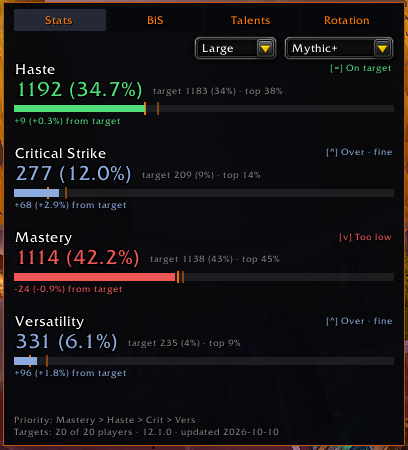 |

| Medium | Small |
|---|---|
| 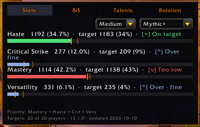 | 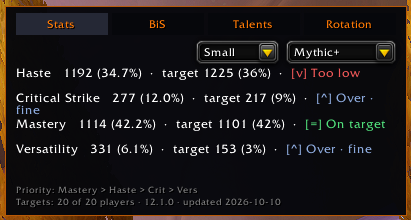 |

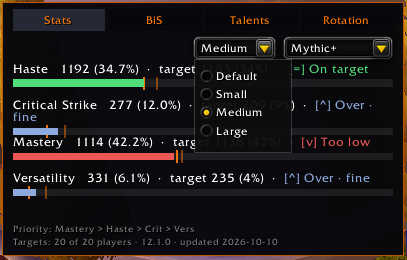

**Rotation**: the Rotation tab opens the rotation window. Hover any icon for the spell's own tooltip and how top players use it.

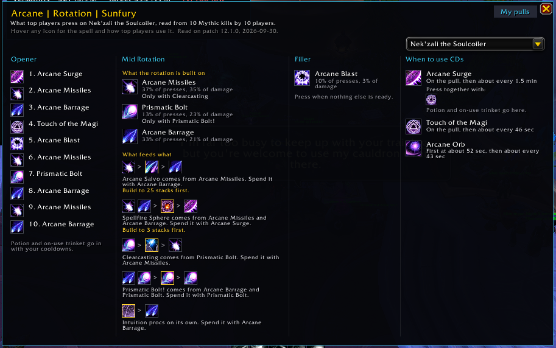

Healers get the spells the rotation is built on and what feeds what. Cooldowns follow the boss's damage, so they aren't read from logs:

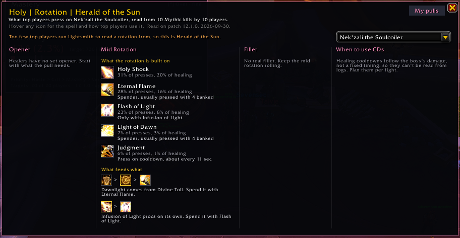

**Talents**: the window shows your spec's class, hero and spec trees with the top-player build highlighted in gold. Switch between Raid and Mythic+ at the top, pick a boss, a dungeon or Overall from the dropdown, and hover any talent to see how many players take it.

| Restoration Druid, one raid boss | Holy Paladin, Mythic+ overall |
|---|---|
| 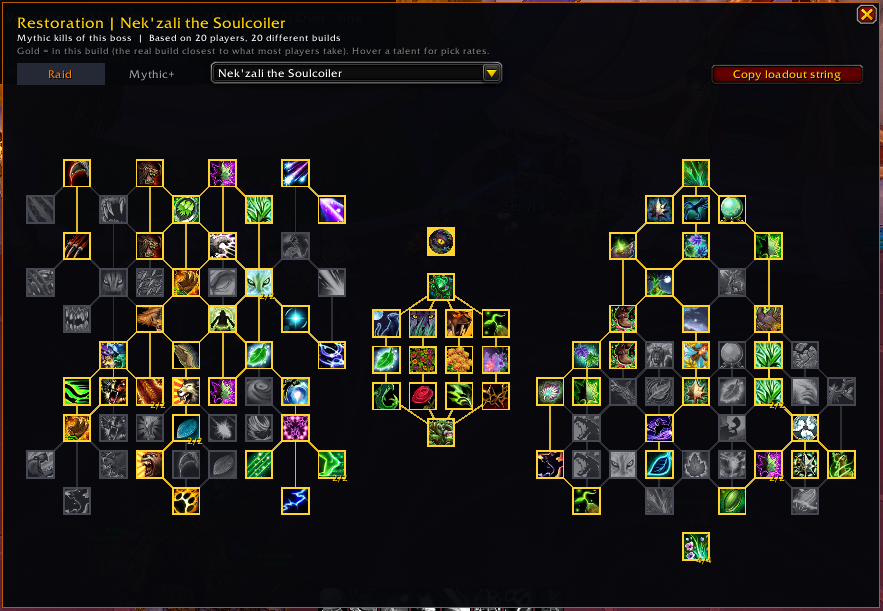 |  |

**BiS Gear**, with the enchant and gem top players use, item-level-aware status marks and how many of the top 20 wear each item:

| Raid | Mythic+ |
|---|---|
| 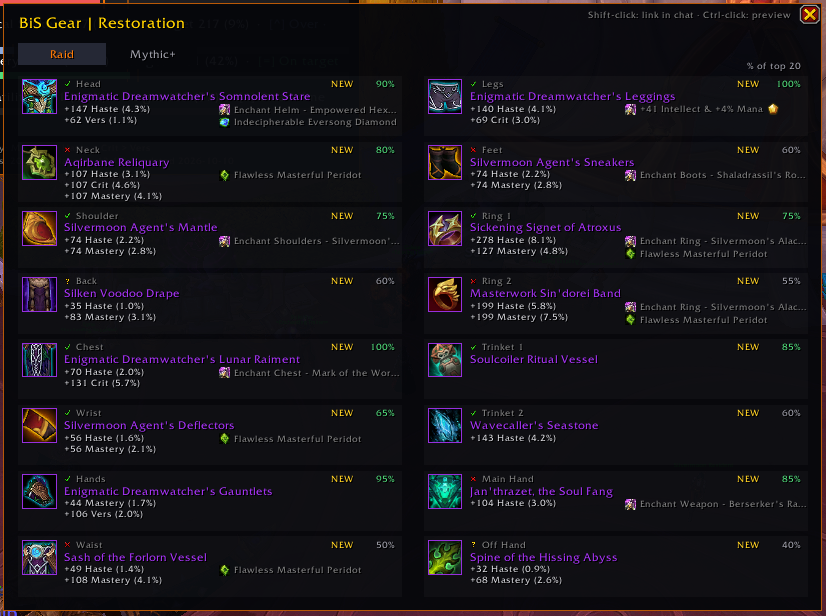 | 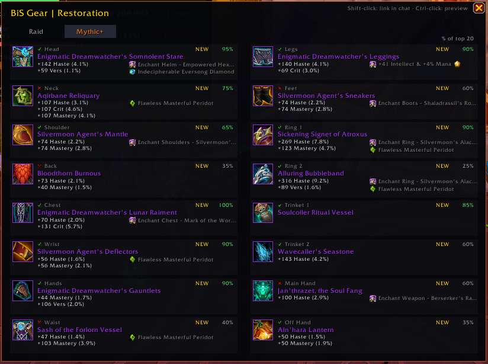 |

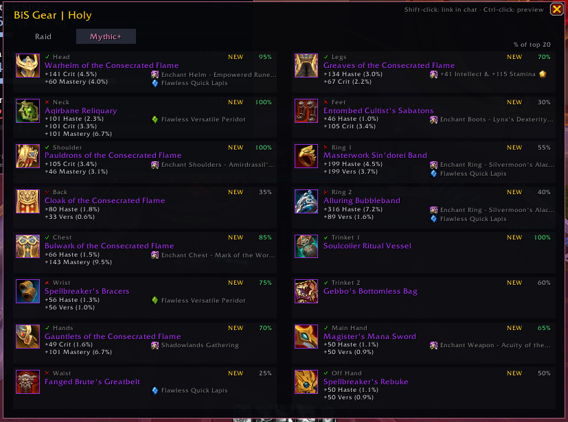

**Your own pulls**: My pulls in the rotation window gives you a link to your page on the RecommendedStats Analyzer.

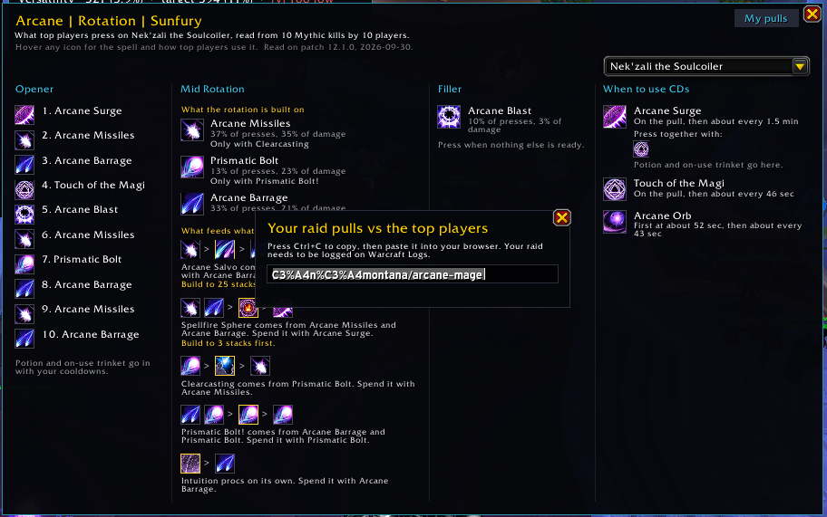

The Analyzer lists your raid nights from Warcraft Logs with every kill and wipe. Pick a pull to see what to work on first, then your presses per minute and cooldowns next to the top players of your spec on that boss.

| Your raid nights | One pull |
|---|---|
| 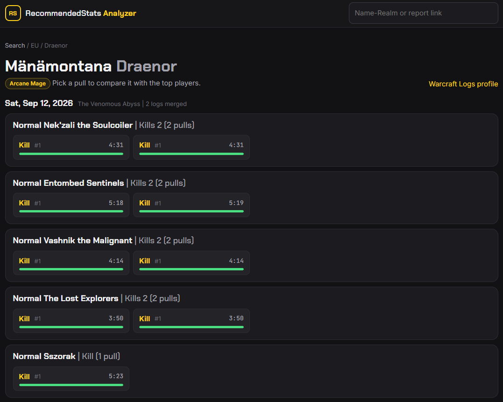 | 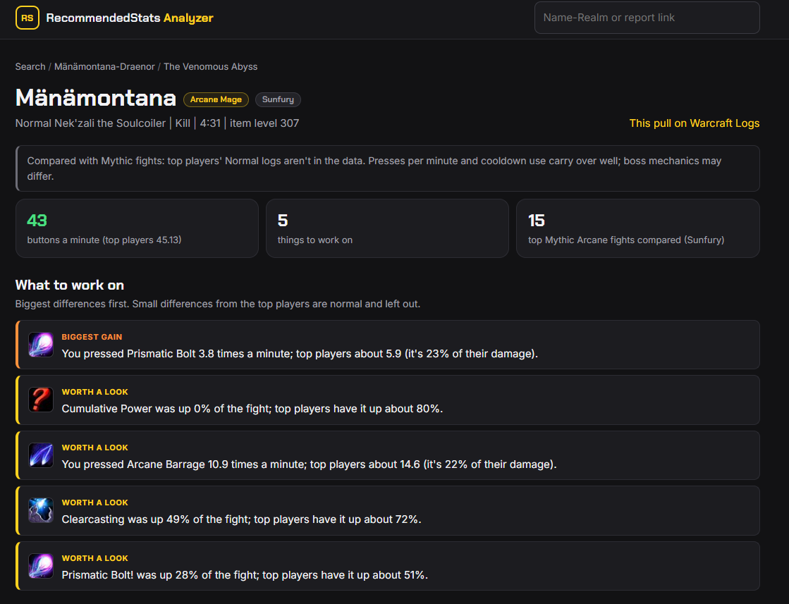 |

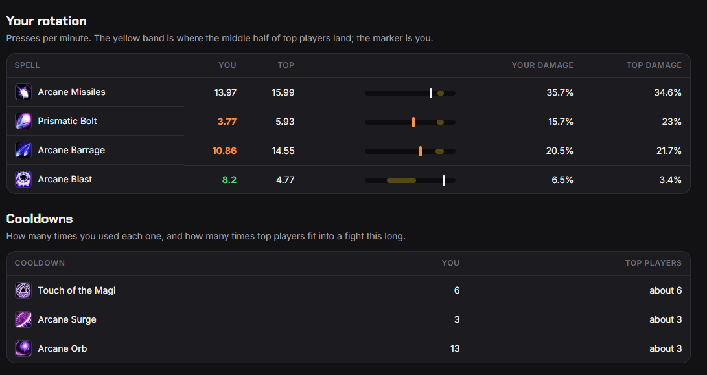

## Installation

1. Download the latest release (or clone this repo) into your WoW `Interface/AddOns` folder so you end up with `Interface/AddOns/RecommendedStats/RecommendedStats.toc`.
2. Restart WoW or reload your UI (`/reload`).
3. Enable RecommendedStats in the AddOns list if it isn't already.

## Usage

Open your character screen (`C`) and the stat panel appears automatically. The tabs along its top switch between Stats and the BiS, Talents and Rotation windows.

**Minimap button**
- Left-click: show/hide the panel
- Right-click: open options

**Talents**

Click the **Talents** tab (or type `/rs talents`) to open the talents window.

1. Choose **Raid** or **Mythic+** at the top.
2. Pick **Overall** for your spec's general build, or a specific boss or dungeon from the dropdown.
3. Hover any talent to see how many top players take it. Choice talents show the split for each option.
4. Press **Copy loadout string**, then paste it into the game's talent **Import** to apply the build.

The window is movable, remembers its position, and closes with Escape.

**Rotation**

Click the **Rotation** tab (or type `/rs rotation`) to open the rotation window. It follows your current spec and hero talents.

1. Leave the dropdown on **Overall** for all bosses pooled, or pick a raid boss to see how that fight is played. A council or add fight is played differently from a single target one.
2. Read the four columns left to right:
   - **Opener**: the presses most top players make at the pull, in their usual order.
   - **Mid Rotation**: the spells the rotation is built on, then "what feeds what": which press gives a proc or buff, which press spends it, and how many stacks to build first.
   - **Filler**: what to press when nothing else is ready.
   - **When to use CDs**: when each long cooldown is first used, how often, and what it is pressed together with.
3. Hover any icon for the spell's tooltip and a line on how top players use it.

If too few top players run your hero talents to read a rotation from, the window shows the tree they do run and says so. Healers get the Mid Rotation and Filler columns only, since healing cooldowns follow the boss's damage rather than a fixed timing.

**Your own pulls**

Click **My pulls** at the top of the rotation window (or type `/rs link`) for a link to your page on the [RecommendedStats Analyzer](https://rs.ctrlshiftzed.com). Press Ctrl+C and paste it into your browser. The page lists your raid nights from Warcraft Logs with every kill and wipe; pick one to see your casts, cooldowns and buffs next to the top players of your spec on that boss. Your raid needs to be logged on Warcraft Logs, by you or anyone in it.

**Slash commands**

| Command | Effect |
|---|---|
| `/rs` | Print the current content setting |
| `/rs raid` | Show targets for Raid |
| `/rs mythicplus` (or `/rs m+`) | Show targets for Mythic+ |
| `/rs resetpos` | Reset panel positions back to their default dock point |
| `/rs bis` | Open or close the BiS gear window |
| `/rs talents` | Open or close the talents window |
| `/rs rotation` | Open or close the rotation window |
| `/rs link` | Copy the link to your page on the RecommendedStats Analyzer |
| `/rs options` | Open the options panel |
| `/rs skin export` | Copy your skin as a code to share |
| `/rs skin import` | Paste a skin code from someone else |

## Options

Available via Esc > Options > AddOns > RecommendedStats, or `/rs options`, or right-clicking the minimap button.

- **Window position**: attach to the character screen, or leave unattached so it can be moved and shown independently.
- **Show "Stats" tab** and **Show "BiS" button**: hide the parts you don't use.
- **Show minimap icon**.
- **Colorblind-friendly icons**.
- **Row size**: Default, Small, Medium or Large.
- **Skin**: Default, Class Color or Custom Color, with **Export Skin** and **Import Skin** to share a look.

## How targets are calculated

Stat targets and BiS gear are built from a sample of top players per class, spec, and content type (raid or Mythic+). Warcraft Logs surfaces who those players are, the top parsers on every raid boss and the top Mythic+ players in every dungeon, and the Battle.net API supplies each one's exact stat percentages and equipped gear. The current data set is built from a sample of up to 20 players per spec and is refreshed as new content and patches land, the exact sample size and last-updated date are shown in the footer of the stat panel.

Stats are compared as:
- **Too low**: noticeably under target
- **On target**: within half a percentage point of target
- **Over, fine**: above target, which isn't a problem, it just means the point could be better spent elsewhere

## How talent builds are chosen

Talent builds come from top players' real loadouts: Mythic+ runs (per dungeon) and raid kills (per boss) from raider.io, plus a spec-wide build from the same sample used for stat targets. Where a boss or dungeon has too few exact kill or run builds, the current builds of the top players on that encounter are used instead, and the window labels which one you're seeing.

- **The highlighted build is a real player's build**, the one that agrees most with what the group takes overall, so it is always valid and importable. A "most popular talent" mash-up could break choice talents or the point cap.
- **Pick rates** in each talent's tooltip show how many of the sampled players take it.
- **Not enough data for a boss or dungeon?** You'll see your spec's overall build instead, and the dropdown marks those entries "(overall build)". Raid bosses fall back from Mythic to Heroic to Normal kills first, and the dropdown shows which difficulty you're looking at.
- **Raid and Mythic+ never stand in for each other**, since the two are built for different things.
- Late bosses can have few kills early in a tier, so they may show the overall build until more data comes in.

## How the rotation guide is built

The rotation guide is read from the combat logs of top-parsing raid kills on Warcraft Logs, up to 10 per boss for every spec. Nothing in it is written by hand: it is what those players pressed.

- **The opener** is each press placed by its typical position across those kills, so a potion or trinket landing in a slightly different slot for every player doesn't scramble it.
- **Procs and buffs** are matched to the press that comes just before a buff is gained and the press made at the moment it is spent. "Build to 25 stacks first" means top players typically spend it at 25.
- **Filler** is what gets pressed back to back and does clearly less per press than the rest of the rotation.
- **Potions, trinkets and racials** are folded into a single note rather than named, since they change every tier.
- **Raid only for now.** Boss fights with several targets give a hint of how a spec plays in Mythic+, but not the full picture.
- Rotations change with patches, not day to day, so this data is refreshed about once a month or after a patch rather than with every release. The window shows the patch and date it was read on.

**It won't increase your DPS by itself.** It is a guide to how your class works and what takes priority in the rotation, not a "press this now" helper. It reads nothing about the fight you are in.

## A note on combat and instances

Blizzard's Secret Values system restricts reading exact stat values while you're in an instance or in combat. When that happens, RecommendedStats still shows your current value and the progress bar, it just can't render a "too low / on target / over" verdict until the restriction lifts.

## Supported classes and specs

All current class/spec combinations are supported. If you find a spec with no data yet for your content type, the panel will say so rather than showing stale or wrong numbers.

## Feedback and issues

Found a bug, a spec with missing data, or a suggestion? Open an issue on this repo.

## Contributing a translation

RecommendedStats doesn't have a translation for your language yet? Contributions are welcome.

1. Copy `RecommendedStats/Locale/enUS.lua` as your starting point.
2. Change the locale guard at the top of the copy to your client's locale code (e.g. `deDE`, `frFR`, `zhCN`) and translate the text on the right-hand side of each `L.KEY = "..."` line, leave the keys themselves untouched.
3. Every `%s`, `%d`, `%.0f%%`, etc. in a line has to appear the same number of times, in the same order, as the English original. These get filled in with real values (dates, percentages, item names) at runtime, and a missing or mismatched one causes an in-game error rather than a display glitch.
4. Send the finished file as an issue or PR on this repo, or reach out directly.

New locale files only activate for players running that client locale, so a translation can never affect anyone using a different one.

## Support

RecommendedStats is free. If it helps you, you can buy me a coffee:

## License

MIT
